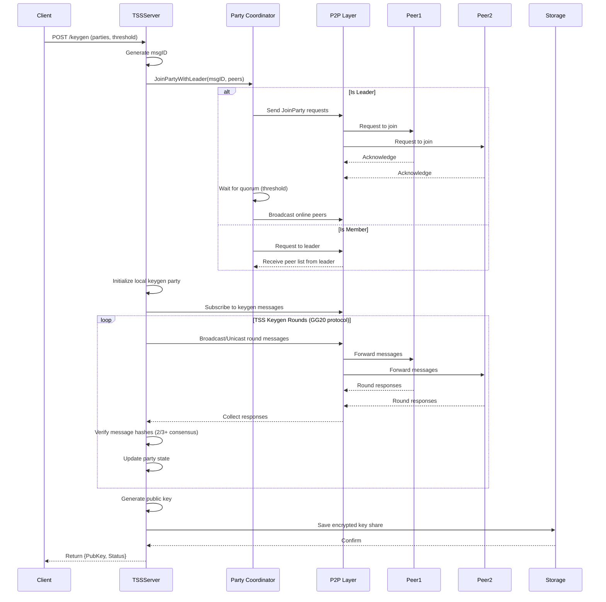
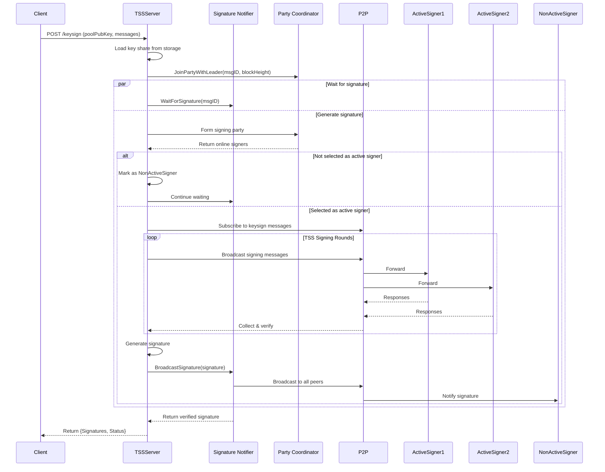
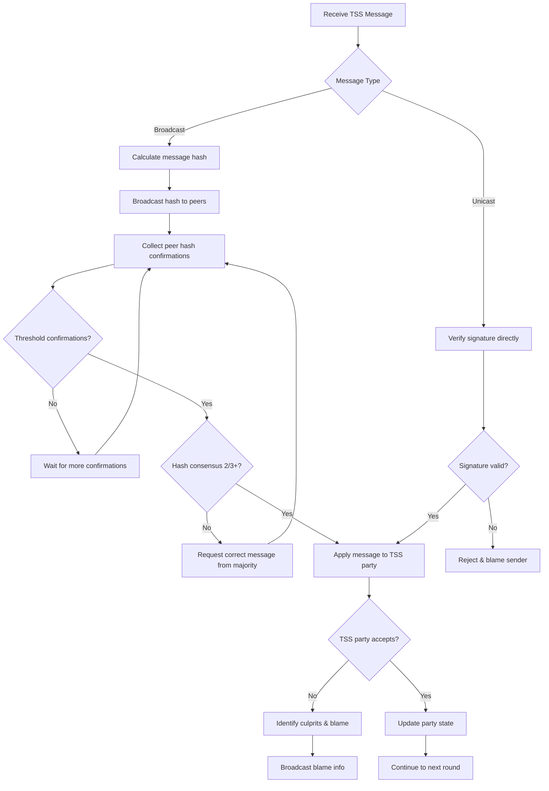

# ZetaChain TSS (Threshold Signature Scheme) - Security Analysis

## Executive Summary

This document provides a comprehensive security analysis of the ZetaChain go-tss implementation, a peer-to-peer threshold signature scheme server forked from ThorChain's TSS and based on Binance's tss-lib. The system enables distributed cryptographic key generation and signing operations across multiple parties without any single party knowing the complete private key.

**Analysis Date:** 2025-11-10  
**Version Analyzed:** Based on git branch `cursor/blockchain-security-audit-and-vulnerability-research-1a4a`  
**Primary Language:** Go 1.22.11  
**Key Dependencies:** bnb-chain/tss-lib, libp2p, cosmos-sdk

---

## 1. System Architecture Overview

### 1.1 High-Level Description

The ZetaChain TSS implementation provides a distributed threshold signature system that allows multiple parties to collectively generate keys and sign messages without any single party having access to the complete private key. This is critical for blockchain operations where decentralization and fault tolerance are paramount.

**Core Functionality:**
- **Threshold Key Generation (Keygen):** Distributed key generation where threshold+1 parties must participate to create valid signatures
- **Threshold Key Signing (Keysign):** Distributed signing of messages/transactions using previously generated threshold keys
- **P2P Communication:** libp2p-based networking layer with peer discovery and message routing
- **Blame Attribution:** Fault detection and attribution system to identify malicious or faulty parties
- **State Management:** Encrypted local storage of key shares and state

### 1.2 Component Architecture

```
┌─────────────────────────────────────────────────────────────────┐
│                        TSS Server (Main)                         │
├─────────────────────────────────────────────────────────────────┤
│  - HTTP API Layer (cmd/tss/tss_http.go)                        │
│  - Server Orchestration (tss/tss.go)                            │
└────────────┬────────────────────────────────┬───────────────────┘
             │                                │
    ┌────────▼────────┐              ┌───────▼──────────┐
    │   Keygen Logic  │              │  Keysign Logic   │
    │  (keygen/*.go)  │              │ (keysign/*.go)   │
    │  - ECDSA        │              │  - ECDSA         │
    │  - EdDSA        │              │  - EdDSA         │
    └────────┬────────┘              └───────┬──────────┘
             │                                │
             └────────────┬───────────────────┘
                          │
              ┌───────────▼────────────┐
              │   Common TSS Logic     │
              │   (common/tss.go)      │
              │  - Message handling    │
              │  - Hash verification   │
              │  - Share distribution  │
              └───────────┬────────────┘
                          │
         ┌────────────────┼────────────────┐
         │                │                │
    ┌────▼─────┐    ┌────▼─────┐    ┌────▼─────┐
    │   P2P    │    │  Blame   │    │ Storage  │
    │ (p2p/*.go)│    │(blame/*.go)│    │(storage/)|
    │ - libp2p │    │ - Fault   │    │ - AES-GCM│
    │ - Streams│    │   detect  │    │ - Local  │
    │ - Party  │    │ - Culprits│    │   state  │
    │   coord  │    │          │    │          │
    └──────────┘    └──────────┘    └──────────┘
```

### 1.3 Technology Stack

- **Language:** Go 1.22.11
- **Cryptography:** 
  - tss-lib (threshold signatures - GG20 protocol)
  - ECDSA (secp256k1)
  - EdDSA (ed25519)
  - AES-256-GCM (local storage encryption)
- **Networking:** libp2p 0.25.1 (custom fork)
- **Storage:** File-based encrypted local state
- **Monitoring:** Prometheus metrics

---

## 2. Data Flow Analysis

### 2.1 Keygen Flow (Key Generation)



### 2.2 Keysign Flow (Signature Generation)



### 2.3 Message Verification Flow



---

## 3. Security Model & Threat Analysis

### 3.1 Security Assumptions

**Trust Model:**
1. **Threshold Security:** System is secure as long as fewer than `threshold` parties are compromised
2. **Honest Majority:** Requires 2/3+ honest parties for hash verification consensus
3. **Byzantine Fault Tolerance:** Can tolerate up to `threshold-1` malicious/faulty nodes
4. **Network Assumptions:** Assumes authenticated peer-to-peer channels (via libp2p)
5. **No Single Point of Failure:** No single party can reconstruct the complete private key

**Cryptographic Guarantees:**
- **Key Confidentiality:** Private key shares are never reconstructed in full
- **Signature Validity:** Signatures are unforgeable without threshold+ parties
- **Forward Secrecy:** Compromise of key shares doesn't affect past signatures
- **Unforgeability:** Attackers cannot create valid signatures without threshold+ key shares

### 3.2 Attack Surface Analysis

#### 3.2.1 Network Layer Attacks

**1. Peer Identity Spoofing**
- **Risk:** Medium-High
- **Description:** Attacker attempts to impersonate legitimate peer
- **Mitigation:** 
  - libp2p cryptographic peer IDs
  - Whitelist-based connection gater
  - Message signature verification
- **Residual Risk:** Compromised peer private keys could allow impersonation

**2. Eclipse Attack**
- **Risk:** High
- **Description:** Isolate victim from legitimate network, feed malicious data
- **Mitigation:**
  - Bootstrap peer connections
  - Peer address book persistence
  - Multiple peer connections required
- **Residual Risk:** If bootstrap peers are compromised or network-level attacks

**3. Sybil Attack**
- **Risk:** Low-Medium
- **Description:** Attacker creates many fake identities
- **Mitigation:**
  - Whitelist enforcement (only known peers allowed)
  - Party membership determined by blockchain state
- **Residual Risk:** Minimal with proper whitelist management

**4. Man-in-the-Middle (MITM)**
- **Risk:** Low
- **Description:** Intercept and modify communications
- **Mitigation:**
  - libp2p encrypted transport
  - Message signatures with node private keys
  - Hash consensus verification
- **Residual Risk:** Low with proper libp2p configuration

**5. Denial of Service (DoS)**
- **Risk:** High
- **Description:** Flood with requests, exhaust resources, prevent legitimate operations
- **Mitigations:**
  - Connection limits (1024-1500 connections)
  - Resource manager with protocol-specific limits
  - Stream timeouts
  - Whitelist gating
- **Residual Risk:** Legitimate whitelisted peers could DoS

#### 3.2.2 Cryptographic Attacks

**1. Threshold Key Recovery**
- **Risk:** Critical
- **Description:** Attacker gains threshold+ key shares
- **Mitigation:**
  - Encrypted local storage (AES-256-GCM)
  - File permissions (0600)
  - No key share transmission
- **Residual Risk:** Depends on operational security of node operators

**2. Signature Forgery**
- **Risk:** Critical
- **Description:** Generate valid signatures without threshold parties
- **Mitigation:**
  - GG20 protocol security guarantees
  - tss-lib implementation (audited by Binance)
- **Residual Risk:** Implementation bugs in tss-lib

**3. Malicious Share Injection**
- **Risk:** High
- **Description:** Inject invalid cryptographic shares to disrupt TSS
- **Mitigation:**
  - Message signature verification
  - TSS protocol validation (in tss-lib)
  - Blame mechanism to identify culprits
- **Residual Risk:** Detection only, not prevention

**4. Replay Attacks**
- **Risk:** Medium
- **Description:** Reuse old valid messages
- **Mitigation:**
  - Message IDs tied to specific operations
  - Block height in keysign requests
  - Monotonic state progression
- **Residual Risk:** Limited attack window

#### 3.2.3 Protocol Logic Attacks

**1. Party Coordination Manipulation**
- **Risk:** High
- **Description:** Manipulate leader election or party formation
- **Mitigation:**
  - Deterministic leader selection (PickLeader based on msgID + blockHeight)
  - All parties independently verify leader
- **Residual Risk:** Leader has significant influence on party formation

**2. Blame System Manipulation**
- **Risk:** Medium
- **Description:** False blame or avoid blame detection
- **Mitigation:**
  - Cryptographic proofs in blame (signatures, messages)
  - Multiple blame strategies (share level, node level)
- **Residual Risk:** Blame is informational, not enforced by this system

**3. Hash Consensus Bypass**
- **Risk:** High
- **Description:** Bypass 2/3+ hash verification
- **Mitigation:**
  - Strict threshold checking
  - Data owner prevented from voting on own messages
- **Residual Risk:** 2/3+ colluding malicious nodes can bypass

**4. Race Conditions**
- **Risk:** Medium
- **Description:** Concurrent access to shared state
- **Mitigation:**
  - Extensive use of sync.Mutex, sync.RWMutex
  - Atomic operations where appropriate
- **Residual Risk:** Complex concurrency patterns, potential edge cases

#### 3.2.4 Implementation & Operational Attacks

**1. Memory Corruption**
- **Risk:** Medium
- **Description:** Buffer overflows, use-after-free
- **Mitigation:**
  - Go memory safety
  - No unsafe pointer operations observed
- **Residual Risk:** Dependencies (especially libp2p, tss-lib) could have issues

**2. Side-Channel Attacks**
- **Risk:** Medium
- **Description:** Timing attacks, power analysis
- **Mitigation:**
  - Constant-time crypto operations (in crypto libraries)
- **Residual Risk:** Not all operations are constant-time

**3. Dependency Vulnerabilities**
- **Risk:** High
- **Description:** Vulnerabilities in third-party libraries
- **Notable Dependencies:**
  - tss-lib (custom fork)
  - libp2p (custom fork)
  - cosmos-sdk
- **Mitigation:**
  - Regular updates
  - Custom forks allow patching
- **Residual Risk:** Must monitor and update dependencies

**4. Storage Attacks**
- **Risk:** High
- **Description:** Access encrypted key shares, decrypt password
- **Mitigation:**
  - AES-256-GCM encryption
  - Password/seed from environment variable
  - File permissions
- **Residual Risk:** Weak passwords, leaked env vars, root access

**5. Information Leakage**
- **Risk:** Medium
- **Description:** Logs, errors expose sensitive information
- **Mitigation:**
  - Careful logging (don't log message payloads)
  - Error messages sanitized
- **Residual Risk:** Debug logs might expose more info

### 3.3 Threat Actors & Scenarios

**1. Malicious Insider (Compromised Node Operator)**
- **Capability:** Full control of one or more nodes (< threshold)
- **Goals:** Disrupt operations, gain intelligence, DoS
- **Impact:** Can disrupt but not forge signatures alone

**2. External Attacker (Network-Level)**
- **Capability:** Network traffic interception, DDoS
- **Goals:** Prevent legitimate operations, isolate nodes
- **Impact:** Availability impact, limited confidentiality/integrity risk

**3. Supply Chain Attacker**
- **Capability:** Compromise dependencies or build process
- **Goals:** Backdoor, steal keys, manipulate signatures
- **Impact:** Critical if successful

**4. Coordinated Malicious Coalition (threshold+ nodes)**
- **Capability:** Control threshold or more nodes
- **Goals:** Forge signatures, steal funds
- **Impact:** **COMPLETE SYSTEM COMPROMISE**

---

## 4. Security Controls & Defenses

### 4.1 Authentication & Authorization

| Control | Implementation | Effectiveness |
|---------|----------------|---------------|
| **Peer Authentication** | libp2p cryptographic peer IDs | Strong |
| **Message Signatures** | secp256k1 signatures on all messages | Strong |
| **Whitelist Enforcement** | Connection gater filters non-whitelisted peers | Strong (if maintained) |
| **Party Membership** | Determined by blockchain state (off-chain) | Depends on external system |

### 4.2 Confidentiality

| Control | Implementation | Effectiveness |
|---------|----------------|---------------|
| **Key Share Encryption** | AES-256-GCM with SHA256-derived key | Strong (password-dependent) |
| **Transport Encryption** | libp2p encrypted channels | Strong |
| **No Key Reconstruction** | TSS protocol never assembles full key | Strong (protocol guarantee) |
| **File Permissions** | 0600 on sensitive files | Medium (OS-dependent) |

### 4.3 Integrity

| Control | Implementation | Effectiveness |
|---------|----------------|---------------|
| **Hash Consensus** | 2/3+ peers must agree on message hash | Strong (Byzantine tolerant) |
| **Message Signatures** | All messages cryptographically signed | Strong |
| **TSS Protocol Validation** | tss-lib validates all cryptographic operations | Strong (depends on tss-lib) |
| **Blame System** | Identifies and records malicious parties | Medium (detection only) |

### 4.4 Availability

| Control | Implementation | Effectiveness |
|---------|----------------|---------------|
| **Threshold Redundancy** | Only threshold+1 parties needed (not all) | Strong |
| **Timeout Mechanisms** | Configurable timeouts for all operations | Medium |
| **Connection Limits** | Resource manager limits | Medium |
| **Automatic Retry** | Party join retries, peer reconnection | Medium |

### 4.5 Monitoring & Auditability

| Control | Implementation | Effectiveness |
|---------|----------------|---------------|
| **Structured Logging** | zerolog with contextual fields | Strong |
| **Prometheus Metrics** | Keygen/keysign success rates, latency | Strong |
| **Blame Records** | Detailed blame information with proofs | Strong |
| **P2P Metrics** | Connection stats, message counts | Medium |

---

## 5. Key Security Properties

### 5.1 Guaranteed Properties (Assuming Honest Majority)

✅ **Threshold Security:** No single party or coalition of < threshold parties can forge signatures  
✅ **Fault Tolerance:** System continues operation with threshold+1 available parties  
✅ **Blame Attribution:** Malicious parties can be identified with cryptographic proof  
✅ **Message Authenticity:** All messages are cryptographically authenticated  
✅ **Key Confidentiality:** Private key is never reconstructed in full  

### 5.2 Conditional Properties

⚠️ **Byzantine Tolerance:** Assumes < threshold malicious parties  
⚠️ **Network Security:** Depends on libp2p security and peer whitelist accuracy  
⚠️ **Storage Security:** Depends on password strength and operational security  
⚠️ **Availability:** Subject to network conditions and DoS attacks  

### 5.3 Known Limitations

❌ **No Economic Incentives:** Blame doesn't enforce penalties (handled externally)  
❌ **Leader Influence:** Party leader has significant control over party formation  
❌ **Whitelist Dependency:** Security relies on accurate peer whitelist maintenance  
❌ **Password Storage:** Encryption key derivation depends on password/env variable security  
❌ **No Proactive Security:** Keys are not rotated or refreshed  

---

## 6. Historical Vulnerability Context

Based on git history and changelog analysis, the following issues have been previously addressed:

### 6.1 Previously Fixed Issues

1. **Blame Panic (#53)** - Panic condition in blame mechanism
2. **Infinite Discovery Address Leak (#37)** - Memory/resource leak in peer discovery
3. **DHT Security Issues (#34)** - Replaced DHT with private peer discovery
4. **Active Signer Bug (#201)** - Failed to exclude inactive signers in leaderless join party
5. **Bootstrap Connectivity (#200)** - Connection timeout issues with bootstrap nodes
6. **Cache Logic Error (#61)** - Fixed in build
7. **Encrypted Local State (#13)** - Added encryption for key shares
8. **Race Conditions** - Fixed data and logical races in TSS tests
9. **Stream Close Issues** - Proper stream management and cleanup
10. **Message Ordering (#63)** - Strict-weak ordering for messages to sign

### 6.2 Architectural Changes

- **Removed DHT:** Switched from dynamic peer discovery to static whitelist (significant security improvement)
- **Added Leader-Based Party Formation:** More reliable party coordination
- **Introduced Signature Notifier:** Allows non-active signers to receive signatures
- **Enhanced Resource Limits:** libp2p resource manager with protocol-specific limits
- **Whitelist Connection Gater:** Strict peer access control

---

## 7. Trust Boundaries

```
┌─────────────────────────────────────────────────────────────┐
│ External Trust Boundary                                     │
│  - Client applications (zetaclientd)                        │
│  - HTTP API (unauthenticated)                               │
└────────────────────┬────────────────────────────────────────┘
                     │
┌────────────────────▼────────────────────────────────────────┐
│ TSS Server Process                                          │
│  - Assumes correct configuration                            │
│  - Trusts environment variables (passwords)                 │
│  - Trusts local filesystem security                         │
└────────────────────┬────────────────────────────────────────┘
                     │
┌────────────────────▼────────────────────────────────────────┐
│ P2P Network Layer                                           │
│  - Trusts whitelisted peers (authenticated)                 │
│  - Assumes 2/3+ honest participants                         │
│  - Cryptographic authentication of messages                 │
└────────────────────┬────────────────────────────────────────┘
                     │
┌────────────────────▼────────────────────────────────────────┐
│ Cryptographic Core (tss-lib)                                │
│  - Assumes correct implementation of GG20 protocol          │
│  - Trusts underlying crypto primitives (secp256k1, etc.)   │
└─────────────────────────────────────────────────────────────┘
```

---

## 8. Recommended Security Practices

### 8.1 Deployment Best Practices

1. **Strong Password Management:**
   - Use high-entropy passwords for key share encryption
   - Store passwords in secure secret management systems
   - Rotate passwords periodically
   
2. **Network Isolation:**
   - Deploy TSS nodes in isolated network segments
   - Use firewalls to restrict access to TSS ports
   - VPN/wireguard for inter-node communication

3. **Access Control:**
   - Restrict filesystem access to TSS data directory
   - Run TSS process with minimal privileges
   - Enable audit logging at OS level

4. **Monitoring:**
   - Monitor Prometheus metrics for anomalies
   - Alert on keygen/keysign failures
   - Track blame events
   - Monitor peer connectivity

5. **Backup & Recovery:**
   - Secure backups of encrypted key shares
   - Document recovery procedures
   - Test recovery process

### 8.2 Operational Security

1. **Key Lifecycle:**
   - Generate keys in secure environments
   - Never expose unencrypted key shares
   - Securely delete old key shares when rotating

2. **Peer Management:**
   - Maintain accurate whitelist
   - Verify peer identities out-of-band
   - Monitor for peer impersonation attempts

3. **Incident Response:**
   - Procedures for handling blamed nodes
   - Process for investigating TSS failures
   - Coordination channel for operators

---

## 9. Compliance & Standards

### 9.1 Relevant Standards

- **NIST SP 800-63B:** Digital identity guidelines (key management)
- **NIST SP 800-57:** Key management recommendations
- **ISO/IEC 27001:** Information security management
- **PCI DSS:** (If handling payment card data) Cryptographic key management

### 9.2 Cryptographic Standards

- **FIPS 186-4:** Digital Signature Standard (ECDSA)
- **RFC 8032:** Edwards-Curve Digital Signature Algorithm (EdDSA)
- **NIST SP 800-38D:** GCM mode for encryption (AES-GCM)

---

## Appendix A: Configuration Parameters

### Key Security-Related Configuration

| Parameter | Default | Security Impact |
|-----------|---------|-----------------|
| `KeyGenTimeout` | 30s | Shorter = less time for attacks, but higher failure rate |
| `KeySignTimeout` | 30s | Shorter = less time for attacks, but higher failure rate |
| `PartyTimeout` | 10s | Affects party formation reliability |
| `PreParamTimeout` | 5m | Pre-computation of crypto parameters |
| `StreamTimeoutConnect` | 20s | Network connection timeout |
| `StreamTimeoutRead` | (config) | Read timeout on streams |
| `EnableMonitor` | true | Prometheus metrics collection |

---

## Appendix B: Glossary

- **Threshold Signature Scheme (TSS):** Cryptographic scheme where t+1 out of n parties must cooperate to create signatures
- **GG20 Protocol:** Specific TSS protocol implemented by tss-lib (Gennaro & Goldfeder 2020)
- **Party:** A participant in the TSS protocol (corresponds to a node)
- **Key Share:** A fragment of the private key held by each party
- **Blame:** Attribution of fault to a specific party when TSS fails
- **Leader:** Party responsible for coordinating party formation for a specific operation
- **libp2p:** Modular peer-to-peer networking stack
- **msgID:** Unique identifier for a TSS operation (keygen or keysign)
- **Pool Public Key:** The collective public key resulting from threshold keygen

---

*This analysis is based on the codebase as of 2025-11-10. Security properties may change with code updates. Regular security assessments are recommended.*
